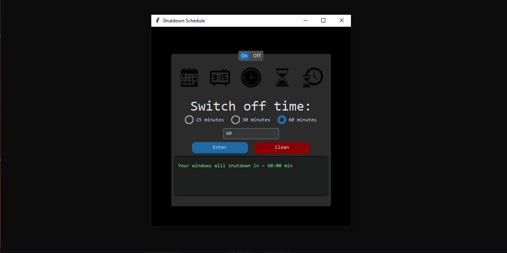

# shutdown-schedule
This is a simple project that uses CustomTkinter, a library to create a simple user interface that allows users to schedule a time for automatic computer shutdown.

## Installation

First, you need to install the customtkinter library on your local machine:

`pip install customtkinter`

Clone this repository to your local machine:

`git clone https://github.com/Luccxx/shutdown-schedule.git`

## How to use

Run the main.py file in your IDE.

The graphical interface will open. You will be able to set the desired time for your PC to automatically shut down.

Click the **Enter** button to confirm the schedule.

*Note: Practices such as entering null values ​​or strings will result in an error message in the interface.*

## Interrupting Shutdown

- Go to the **Off** tab and click on the **Turn Off Shutdown** button.

## Contributions

Contributions are welcome! If you would like to improve this project in any way, feel free to open an issue or submit a pull request.

## License

This project is licensed under the MIT License.